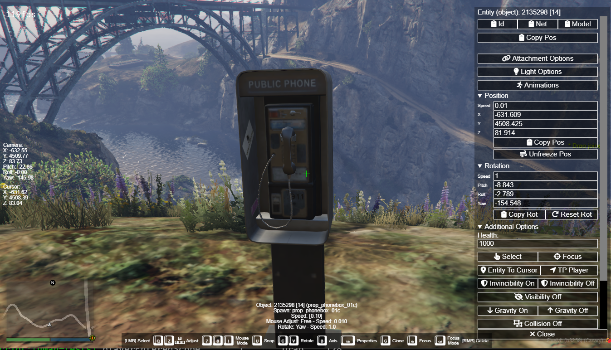
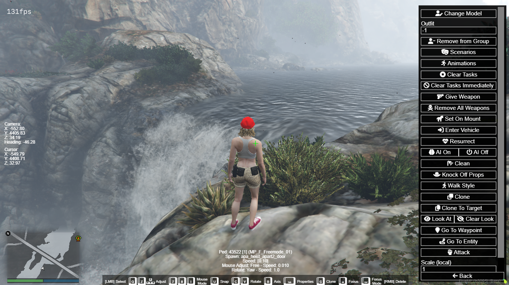

# Spooner

Tool for spawning, placing, and removing entities, inspired by Menyoo's Object Spooner.

# Features

- Freecam mode with a variety of options for placing and adjusting entities
- Searchable lists of peds, vehicles and objects
- View and set properties of an entity, including attaching entities to one another
- Save and load sets of entities
- Saved databases are stored client-side, so you can load them on any server with this resource
- Import and export sets of entities to share with others or to convert to a permanent map
- Permissions system for controlling access to individual features
- Copy entity details such as **Id**, **NetId**, **Model**, **Coords**, **Rotation**
- Preview object animations, and copy an animation to the clipboard to generate the corresponding code (e.g. `PlayEntityAnim` or `TaskPlayAnim`)

<p align="center">
  
</p>

<p align="center">
  
</p>

<div style="display: flex; justify-content: center;">
  <a>
    
  </a>
  <a>
    
  </a>
</div>

# Requirements

None. Works on both FiveM and RedM with no external dependencies.

# Installation

1. Place the resource in your `resources` directory.

2. Add the following to `server.cfg`:

   ```
   exec @luman-spooner/permissions.cfg
   ensure luman-spooner
   ```

3. Restart the server.

# Permissions

By default all players have full access. To limit which players can use the spooner or what parts they can access, edit `permissions.cfg`.

Example:

```
add_ace builtin.everyone spooner.view allow
add_ace builtin.everyone spooner.spawn allow
add_ace builtin.everyone spooner.modify.own allow
add_ace builtin.everyone spooner.delete.own allow
add_ace builtin.everyone spooner.properties allow

add_ace group.admin spooner.noEntityLimit allow
add_ace group.admin spooner.modify.other allow
add_ace group.admin spooner.delete.other allow
```

This lets all players spawn a limited number of entities and modify/delete only their own, while admins can spawn any number of entities and modify/delete other players' entities.

After changing any spooner aces while the server is running, run `spooner_refresh_perms` to apply them on all clients, or restart the resource.

# Usage

## Cursor colours

| Colour | Meaning            |
|--------|--------------------|
| white  | No entity selected |
| green  | Entity highlighted |
| blue   | Entity attached    |

## Controls

| Control                   | Function                                                                         |
|---------------------------|----------------------------------------------------------------------------------|
| W/A/S/D                   | Move                                                                             |
| Spacebar/Shift            | Up/Down                                                                          |
| E                         | Spawn                                                                            |
| Left click                | Entity highlighted: Attach, Entity attached: Detach                              |
| Right click               | Delete selected entity                                                           |
| C/V                       | Rotate                                                                           |
| B                         | Change rotation axis                                                             |
| Q/Z/Arrow keys            | Adjust selected entity position                                                  |
| I                         | Cycle between controlled mouse adjustment modes                                  |
| U                         | Toggle whether entities stick to the ground in controlled mouse adjustment modes |
| 7                         | Turn off mouse adjustment                                                        |
| 8                         | Return to Free mouse adjustment mode                                             |
| G                         | Clone selected entity                                                            |
| Pg Up/Pg Down/Mouse wheel | Change currently selected speed                                                  |
| R                         | Cycle between which speed to change                                              |
| F                         | Open the Spawn menu                                                              |
| X                         | Open the Database menu                                                           |
| Tab                       | Open the Properties menu for the selected entity                                 |
| J                         | Open the Save/Load Database menu                                                 |
| F5                        | Toggle Object Spooner on/off                                                     |
| Escape/Delete             | Exit Object Spooner                                                              |

## Menus

### Spawn menu - F

The **Spawn** menu provides searchable lists to select an entity to spawn. Left-clicking on an entity sets it as your current spawn.

If an entity is not in the list, enter its full model name in the search field and click **Spawn By Name**.

Right-click an entity in any spawn menu to add it as a favourite. Click the favourites button to toggle showing only favourited entities.

### Database menu - X

The **Database** menu stores a list of entities. When an entity is spawned, it is automatically added to the current database. Existing entities can be added/removed from the database via the **Properties** menu.

- Left-click an entity to open it in the **Properties** menu
- Right-click an entity to delete it
- Click **Delete All** to delete all entities in the database

### Properties menu - Tab

The **Properties** menu lists and lets you edit the properties of an entity.

### Save/Load Database menu - J

The **Save/Load Database** menu lets you store your current database with a name and load its entities again later.

- To save, enter a name in the field and click **Save**.
- To load, left-click the name of the database.
- To delete, right-click the name of the database.
- To import or export, click **Import/Export**.

- **Load relative to cursor position** — spawns entities relative to the current cursor position instead of their original coordinates.
- **Replace current DB** — replaces your current database with the loaded one instead of merging them.
- **Save/Load deletions** — saves which entities you delete and deletes them again when the database is loaded.

### Import/Export menu

The **Import/Export** menu imports and exports databases in several formats:

| Format | Description | Export? | Import? |
|--------|-------------|---------|---------|
| Spooner DB JSON | The native format used by the spooner | Yes | Yes |
| Map Editor XML | XML format used by the [Lambdarevolution map editor](https://allmods.net/red-dead-redemption-2/tools-red-dead-redemption-2/rdr2-map-editor-v0-10/) and the [objectloader](https://github.com/kibook/redm-objectloader) resource | Yes | No |
| Ymap | Native map format used by GTA V/RDR2 | Yes | Yes |
| propplacer JSON | [RedEM:RP propplacer](https://github.com/RedEM-RP/redemrp_propplacer) JSON database | Yes | No |
| Spooner Backup | Backup of all spooner databases | Yes | Yes |

To export, select the format and click **Export**. Copy the output from the text box to save it.

To import, paste the input into the text box, select the format, and click **Import**. Imported objects are added to your current database.

Enter a URL of a JSON/XML file in the **Import from URL** field and click **Import** to import from an external source (e.g. pastebin.com). Make sure the URL points to the raw version of the file.

# Credits

Original repository https://github.com/kibook/spooner
